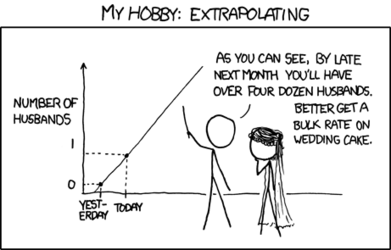

Прогнозирование распространения коронавирусной инфекции.

---
Код:
1) Получение информации о карантинах и индексе самоизоляции;
2) Сбор данных;
3) Частичная "очистка" данных (простой автоэнкодер);
4) Создание фичей;
5) Предварительный отбор фичей;
6) Построение моделей и прогнозирование.

В папке data содержатся все необходимые данные. Дополнительные данные автоматически подгружаются.

Код можно запускать на сайте colab.research.google.com
Все промежуточные данные сохранены.

---

Подробнее о коде:

1 - Даты карантина
1) Данные взяты с сайта - https://en.wikipedia.org/wiki/National_responses_to_the_2019%E2%80%9320_coronavirus_pandemic

Индексы самоизоляции
1) Данные взяты с сайта - https://pastelsky.github.io/covid-19-mobility-tracker/output/{code}/mobility-{place}.csv
2) Данные взяты с сайта - https://yandex.ru/web-maps/covid19/isolation
3) Данные взяты с сайта - https://covid19-static.cdn-apple.com/covid19-mobility-data/2007HotfixDev45/v2/en-us/applemobilitytrends-2020-05-01.csv (поиск актуальной ссылки - https://covid19-static.cdn-apple.com/covid19-mobility-data/current/v2/index.json)

2 - Сбор данных
1) В мире - https://github.com/CSSEGISandData/COVID-19
2) Свежие - https://github.com/CSSEGISandData/COVID-19 web-data
3) По России - https://github.com/grwlf/COVID-19_plus_Russia
4) Свежие по России - https://coronavirus-monitor.ru/jquery-lite-9.js
5) Дополнительные данные - https://coronadatascraper.com/timeseries.csv

3 - Очистка данных

Применяется простая нейронная сеть.

4 - Создание фичей

Основные фичи:
1) Даты введения карантина;
2) Индексы самоизоляции;
3) Характеристики стран;
4) Курение;
5) Фичи по транспорту России.

5 - Тестирование фичей

Можно либо просто добавлять фичи и смотреть разницу результатов, либо сравнивать с тем же числом фич, где добавленная фича заменяется шумом.

6 - Построение моделей и прогнозирование

Добавление фичей:
1) Фичи по окнам (средние, разницы) по заражениям, индексам самоизоляции;
2) Дней с 1,10, 100 зараженного;
3) Дней с введения карантина;
4) Предыдущие значения;
5) Дней с максимального прироста числа заболевших.

Данные о смертности в финальной версии не использовались, как и их прогнозирование.

Очистка данных:
1) Фильтрация данных по числу уникальных значений;
2) Применение cummax для очистки данных;
3) Удаление данных, где число заболевших = 0.

Модели:
1) Lightgbm;
2) Xgboost;
3) Catboost;
4) Adaboost;
5) Random forest;

В финале применялись только первые 3 модели.

Для улучшения результата в данные добавляется шум, чтобы затем усреднить несколько моделей, которые обучались на зашумленных данных.

Алгоритм прогнозирования:

Предсказания моделей строятся на предыдущих предсказаниях. Берется группа моделей, которая предсказывает 7 дней (для каждого дня предсказания усредняюся). Затем берутся эти группы, и уже итоговые предсказания недели усредняюся.

В финале я обучал модели на разных данных, применял разные фичи, убирал и добавлял шум, изменял параметры модели. При этом можно увеличить число групп и число моделей в них. Стоит следить за результатами и вручную изменять параметры, основываясь на предсказаниях моделей.

